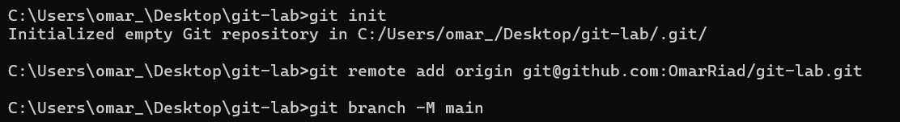
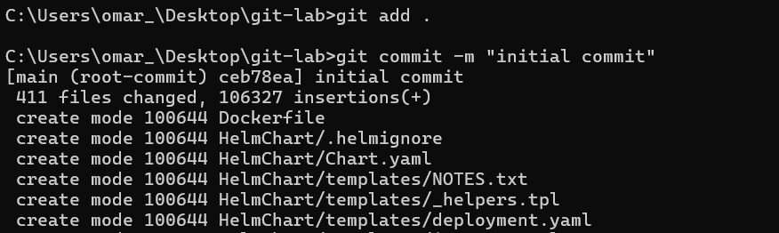
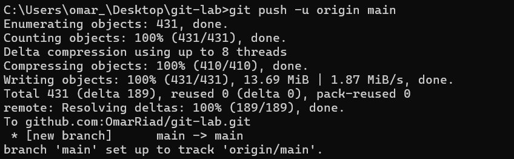

● Create a new project on your local machine, then push it your remote repo.  




● Create two branches (dev & test) then create one file on each branch, and push this changes to the remote repo.  


● Merge this changes on Main branch and then push it to your remote main branch.  


● Tell me how to remove them locally and remotely.  


● Tell me how to checkout another branch without commit changes  


Lab 2

● Create an annotated tag with tagname (v1.7) .  


● Push it to the remote repository.  


● Tell me how to list tags.  


● Tell me how to delete tag locally and remotely  

````<!-- filepath: c:\Users\omar_\Desktop\git-lab\Lab.md -->

● Create a new project on your local machine, then push it your remote repo.  


● Create two branches (dev & test) then create one file on each branch, and push this changes to the remote repo.  


● Merge this changes on Main branch and then push it to your remote main branch.  


● Tell me how to remove them locally and remotely.  


● Tell me how to checkout another branch without commit changes  


Lab 2

● Create an annotated tag with tagname (v1.7) .  


● Push it to the remote repository.  


● Tell me how to list tags.  


● Tell me how to delete tag locally