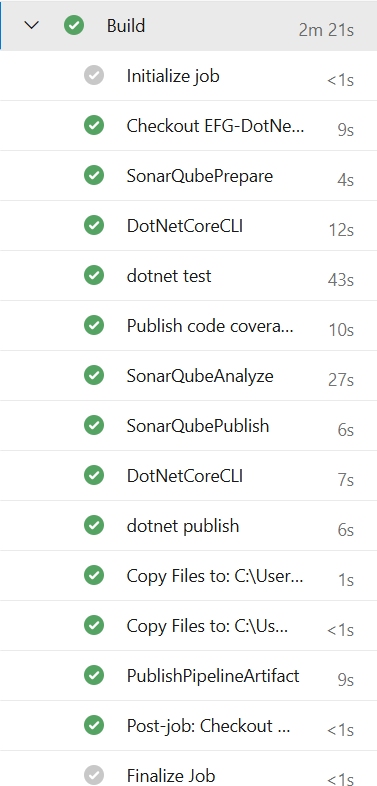
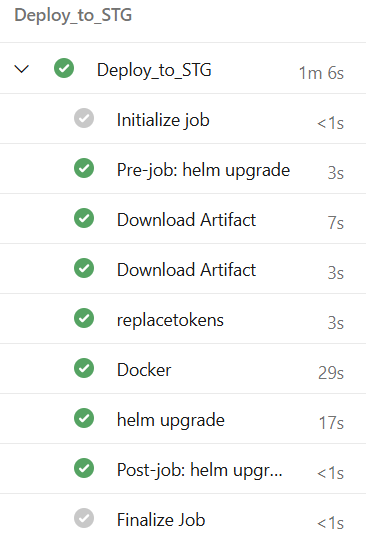
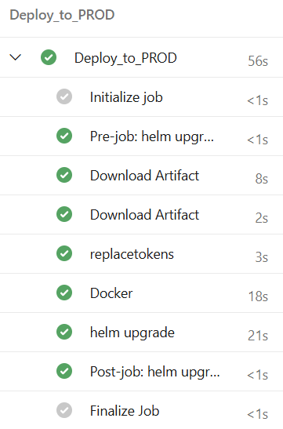
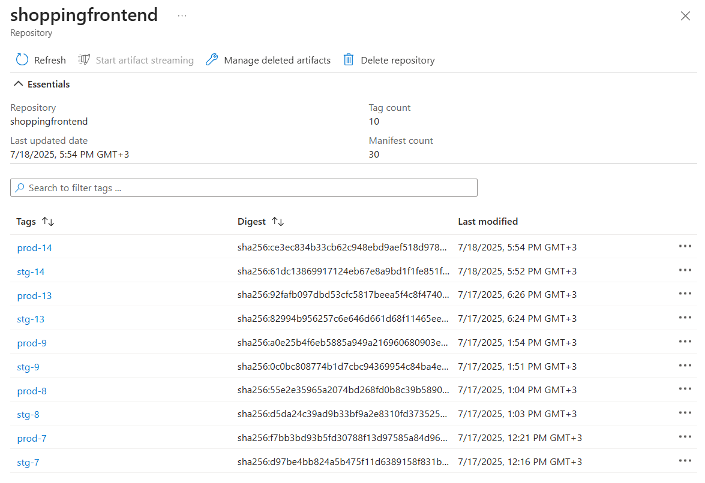
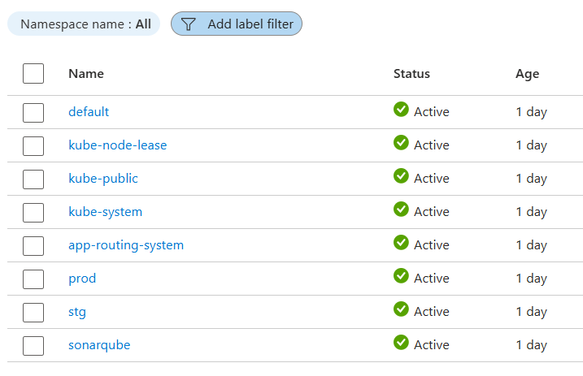
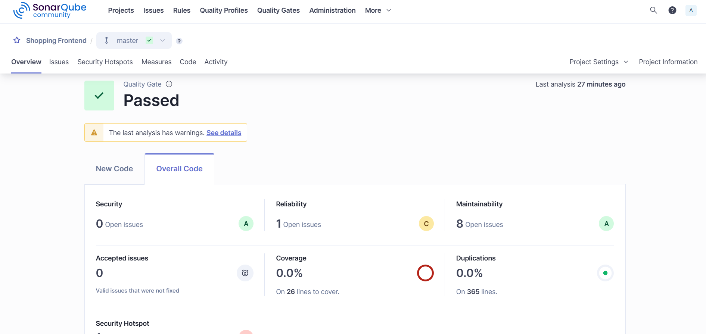
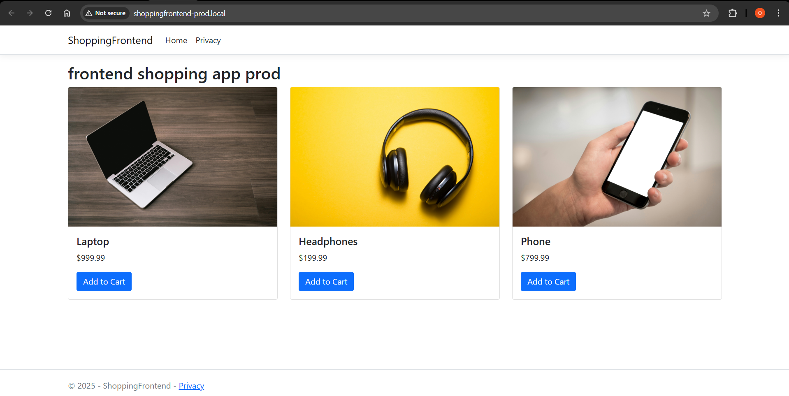

# .NET Core App CI/CD with Azure DevOps & AKS

This project demonstrates a complete DevOps pipeline for a containerized **ASP.NET Core** application deployed to **Azure Kubernetes Service (AKS)** using **Azure DevOps**, **Helm**, and **SonarQube**.

> 🚀 Developed during my internship at **EFG Holding**

---

## 🌐 Project Overview

This repository contains:
- A multi-stage **YAML pipeline** for CI/CD using Azure DevOps
- Dockerfile and Helm chart for packaging, deploying the app, configuring ingress and services
- Configuration for **SonarQube** code analysis
- Pipeline deployment to two environments: **Staging** and **Production**

---

## 🔧 Technologies Used

| Tool           | Purpose                              |
|----------------|--------------------------------------|
| Azure DevOps   | CI/CD pipeline and environment management |
| .NET Core      | Web application framework            |
| Docker         | Containerization                     |
| Azure Container Registry (ACR) | Image storage       |
| Kubernetes (AKS) | Container orchestration            |
| Helm           | Kubernetes deployment via charts     |
| SonarQube      | Static code analysis                 |
| YAML           | Declarative pipeline definition      |

---
## 📸 Screenshots

### ✅ Azure DevOps Pipeline
### ✅ Azure DevOps Pipeline Overview

#### 🔧 Build & Test Stage

#### 🌐 Deploy to Staging

#### 🚀 Deploy to Production

### 📦 Docker Image in ACR

### ☸️ Kubernetes Namespaces

### 🧪 SonarQube Code Quality

---
## 🧪 CI/CD Pipeline Highlights

- **Self-hosted agent** running on a Windows Server VM with:
  - Java
  - Docker
  - Helm
  - kubectl
  - .NET 8.0 SDK
- **Build Stage**
  - Restore, test, and build the app
  - Running tests and Code coverage reporting 
  - SonarQube static code analysis and publishing 
  - App packaging and publishing
- **Deployment Stages**
  - Docker image pushed to ACR
  - Helm-based deployment to AKS
  - Token replacement for environment-specific values
  - Separate Kubernetes namespaces for **staging** and **production**
  - **Pre-deployment approval gate** enabled for production

---

## 🌐 Accessing the App via Ingress

The application is exposed to the internet through an **NGINX Ingress Controller** configured on the AKS cluster.

- The Ingress resource is defined in the Helm chart
- Each environment (`staging`, `production`) uses a unique subdomain or path
- The Ingress controller routes traffic to the correct service inside the appropriate namespace

### 🔗 Example URLs:

- Staging: `http://shoppingfrontend-stg.local/`

- Production: `http://shoppingfrontend-prod.local/`

## 🔐 Security & Configuration

- Secrets and sensitive values are managed via **Azure DevOps variable groups**
- **Service connections** used for:
  - Azure Kubernetes Service (AKS)
  - Azure Container Registry (ACR)
- No hardcoded credentials in the pipeline

---

## 📄 License

This project is for learning and demonstration purposes.

